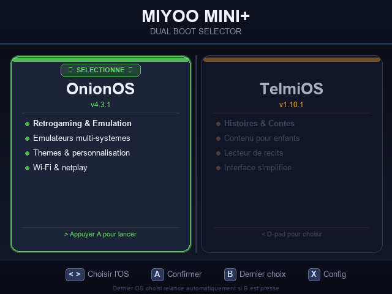
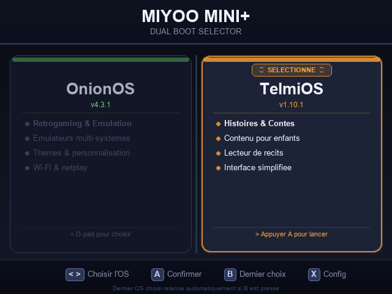
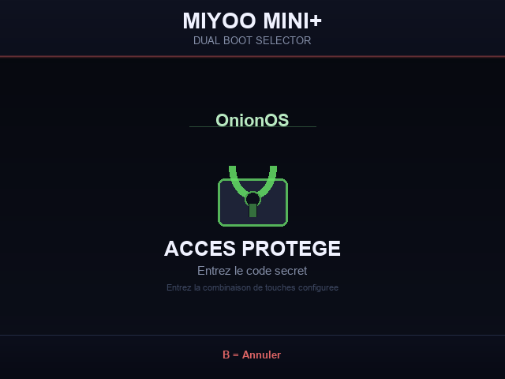
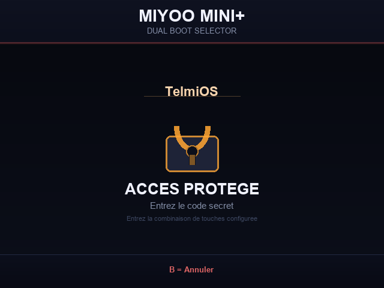
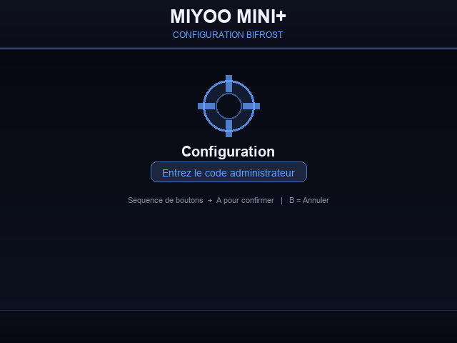
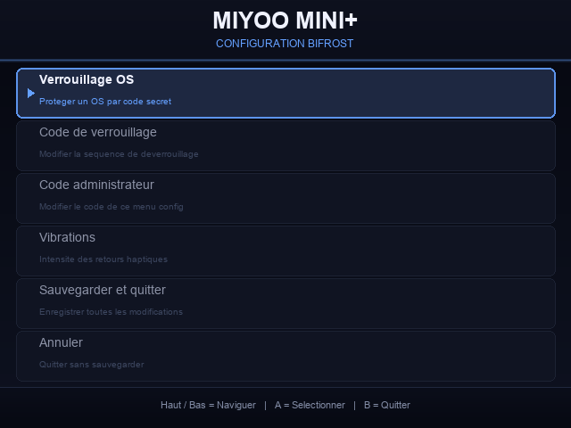
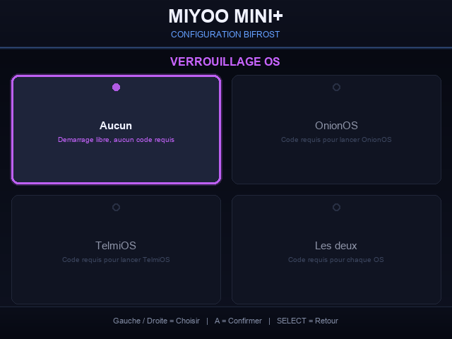
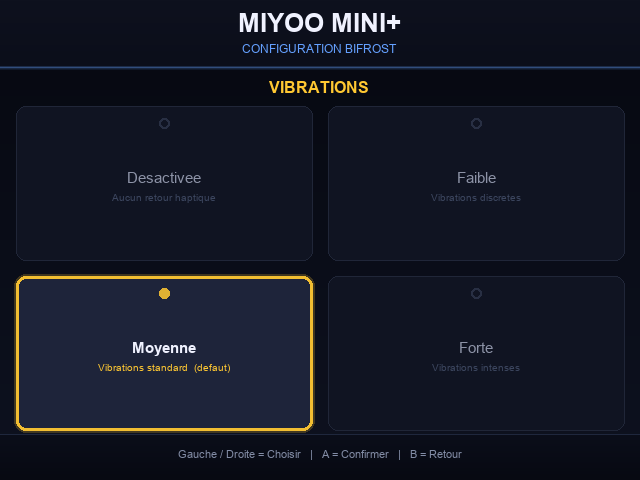
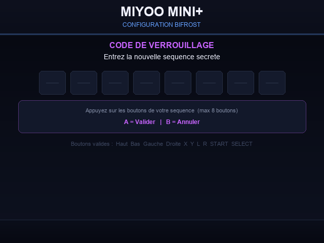
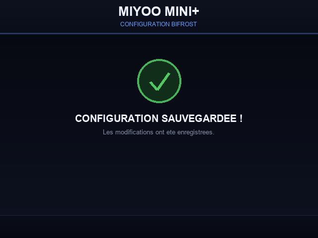

# Miyoo-Bifrost

[](https://github.com/OnionUI/Onion)
[](https://github.com/DantSu/Telmi-story-teller)
[](https://rufus.ie)
[](https://claude.ai/code)

---

# 🇫🇷 Français

**Dual Boot pour Miyoo Mini / Mini Plus — OnionOS + TelmiOS**

Un bootloader léger qui affiche un menu graphique au démarrage pour choisir entre **OnionOS** (retrogaming) et **TelmiOS** (histoires interactives pour enfants), avec protection parentale par code secret optionnelle.

> 🤖 Ce projet a été entièrement **vibe codé avec [Claude Code](https://claude.ai/code)** — l'IA de développement d'Anthropic.

---

## Aperçu

| OnionOS sélectionné | TelmiOS sélectionné |
|---|---|
|  |  |

| Écran protégé OnionOS | Écran protégé TelmiOS |
|---|---|
|  |  |

**Menu de configuration (SELECT)**

| Code admin | Menu principal | Verrouillage OS |
|---|---|---|
|  |  |  |

| Vibrations | Saisie de séquence | Sauvegardé |
|---|---|---|
|  |  |  |

---

## Fonctionnalités

- **Menu graphique** affiché directement sur `/dev/fb0` — pas de SDL, zéro segfault
- **Navigation D-pad** : gauche/droite pour changer d'OS, A pour confirmer, B pour relancer le dernier OS sans passer par le menu
- **Vibration** au changement et à la confirmation (puissance et durée configurables)
- **Timeout 60s** → boot automatique sur le dernier OS choisi si aucune touche pressée
- **Mémorisation** du dernier choix (fichier `.bootchoice` à la racine SD)
- **3 langues** : Français, English, Español — menu et installateur traduits
- **Compatibilité** Miyoo Mini (283) et Miyoo Mini Plus (354) — image pivotée 180° automatiquement pour MM
- **Protection parentale** : code secret par séquence de boutons, configurable par OS (optionnel)
- **Menu de configuration sur la console** : accessible via **X**, protégé par code admin — modifie verrouillage, codes et vibrations directement depuis la Miyoo
- **Compatible Telmi-Sync** : les histoires, sauvegardes et musiques sont accessibles depuis l'application Telmi-Sync sans reformater la carte
- **Configuration** par fichier texte simple sur la SD — aucun accès PC requis après installation
- **Installateur automatique** PowerShell — formate la SD en FAT32, copie tout, génère les images

---

## Versions OS supportées

| OS | Version testée |
|---|---|
| OnionOS | v4.3.1-1 |
| TelmiOS | v1.10.1 |

---

## Prérequis

- PC Windows
- Carte SD formatée en **FAT32** (obligatoire — le firmware Miyoo ne supporte pas exFAT)
  - Carte **≤ 32 Go** : l'installateur peut formater automatiquement via diskpart
  - Carte **> 32 Go** : utilise **[Rufus](https://rufus.ie)** → FAT32, taille d'unité 32 Ko (ou laisse l'installateur le faire)
- **OnionOS** : [github.com/OnionUI/Onion/releases](https://github.com/OnionUI/Onion/releases)
- **TelmiOS** : [github.com/DantSu/Telmi-story-teller/releases](https://github.com/DantSu/Telmi-story-teller/releases)
- **Python 3** *(optionnel)* — pour générer les images du menu de boot

---

## Installation — Guide complet pas à pas

> ⏱️ Durée estimée : 15 à 30 minutes selon la taille de ta carte SD.

---

### Étape 0 — Ce dont tu as besoin

Avant de commencer, télécharge et prépare ces éléments sur ton PC :

| Élément | Où le trouver |
|---|---|
| **Ce projet** (Miyoo-Bifrost) | Bouton vert **Code → Download ZIP** sur cette page |
| **OnionOS** (ex: `Onion-v4.3.1-1.zip`) | [Releases OnionOS](https://github.com/OnionUI/Onion/releases) |
| **TelmiOS** (ex: `TelmiOS_v1.10.1.zip`) | [Releases TelmiOS](https://github.com/DantSu/Telmi-story-teller/releases) |
| **Python 3** *(optionnel)* | [python.org/downloads](https://www.python.org/downloads/) — cocher *"Add to PATH"* |

Extrais les trois archives dans n'importe quel dossier sur ton PC :

```
📁 MonDossier\
    📁 Miyoo-Bifrost\            ← ce projet (extrait du ZIP)
    📁 Onion-v4.3.1-1\           ← contenu de l'archive OnionOS
    📁 TelmiOS_v1.10.1\          ← contenu de l'archive TelmiOS
```

> ✅ **Les noms de dossiers n'ont pas besoin d'être modifiés** — l'installateur détecte automatiquement tout dossier commençant par `Onion` ou `Telmi`.

---

### Étape 1 — Installer Python *(optionnel mais recommandé)*

Python est utilisé pour générer les images du menu de boot (fond noir avec les deux OS en couleur). L'installateur installe **Pillow automatiquement** si Python est présent.

1. Télécharge Python 3 sur [python.org/downloads](https://www.python.org/downloads/)
2. Lance l'installateur et coche bien **"Add Python to PATH"** avant de cliquer *Install Now*

> Si tu sautes cette étape, l'installation fonctionnera quand même mais les images du menu ne seront pas générées — tu verras un écran noir au démarrage avant que la console choisisse l'OS par défaut après 60 secondes.

---

### Étape 2 — Formater la carte SD en FAT32

> ⚠️ **SAUVEGARDE tes ROMs et sauvegardes avant !** Le formatage efface tout.

> ❗ **FAT32 est absolument obligatoire.** Le firmware interne du Miyoo ne lit que le FAT32 — une carte exFAT ou NTFS ne bootera simplement pas (écran noir permanent).

**Option A — Laisser l'installateur formater automatiquement :**
L'installateur détecte si la carte n'est pas en FAT32 et propose de la formater via `diskpart`. Cette méthode fonctionne pour toutes les tailles de carte.

**Option B — Formater manuellement avec Rufus (carte > 32 Go) :**
Windows refuse de formater en FAT32 les cartes > 32 Go via son interface graphique. Utilise **[Rufus](https://rufus.ie)** :
1. Télécharge **[Rufus](https://rufus.ie)** (gratuit, pas d'installation)
2. Sélectionne ta carte SD dans la liste
3. Système de fichiers : **FAT32**, taille d'unité d'allocation : **32 Ko**
4. Clique **Démarrer** → confirme l'effacement

**Option C — Formater manuellement (carte ≤ 32 Go) :**
1. Clic droit sur la carte SD dans l'Explorateur → **Formater...**
2. Système de fichiers : **FAT32**, taille d'unité : **32 Ko**
3. Clique **Démarrer**

---

### Étape 3 — Lancer l'installateur automatique

1. Dans le dossier `Miyoo-Bifrost`, fais un **clic droit** sur `INSTALLER_SD.ps1`
2. Clique **Exécuter avec PowerShell**

   > Si Windows bloque le script : clic droit → **Propriétés** → coche **Débloquer** → OK, puis réessaie.
   >
   > L'installateur demande automatiquement les droits administrateur (nécessaires pour diskpart).

3. **Choix de la langue** : tape `1` (Français), `2` (English) ou `3` (Español)

4. **Trois fenêtres de sélection** s'ouvrent dans l'ordre — navigue et clique OK :
   - 📁 **Carte SD** — sélectionne ton lecteur SD (ex: `E:\`)
   - 📁 **OnionOS** — sélectionne le dossier `Onion-v4.3.1-1`
   - 📁 **TelmiOS** — sélectionne le dossier `TelmiOS_v1.10.1`

5. L'installateur fait tout automatiquement :
   - ✅ Détecte et formate en FAT32 si nécessaire
   - ✅ Copie le bootloader Bifrost sur la SD
   - ✅ Copie les binaires d'OnionOS (prompt, imgpop, etc.)
   - ✅ Copie les librairies SDL de TelmiOS
   - ✅ Installe TelmiOS dans `SD:\telmios\`
   - ✅ Installe OnionOS dans `SD:\onion\`
   - ✅ Installe Pillow si nécessaire (`pip install Pillow` automatique)
   - ✅ Génère les images du menu de boot (FR / EN / ES)
   - ✅ Vérifie que tout est en place

6. À la fin, tu dois voir **"INSTALLATION REUSSIE !"** en vert
   - Si des fichiers sont marqués `[MANQUANT]`, relis les étapes précédentes

> **Note OnionOS :** Au premier démarrage sur OnionOS, l'installateur interne d'Onion se lance automatiquement (durée ~2 minutes). C'est normal — Bifrost le détecte et le lance correctement.

---

### Étape 4 — Éjecter la carte SD proprement

> ⚠️ Ne retire jamais la carte SD brutalement — des données pourraient être corrompues.

1. Dans l'Explorateur de fichiers, fais un **clic droit** sur la carte SD
2. Clique **Éjecter**
3. Attends le message *"Vous pouvez retirer le périphérique"*
4. Retire la carte SD

---

### Étape 5 — Insérer la carte SD et démarrer le Miyoo

1. Insère la carte SD dans ton **Miyoo Mini / Mini Plus**
2. Allume la console en maintenant le bouton Power
3. Le **menu Bifrost** apparaît après quelques secondes :
   - À **gauche** : OnionOS (retrogaming)
   - À **droite** : TelmiOS (histoires interactives)

---

## Utilisation du menu

| Bouton | Action |
|---|---|
| **◄ Gauche** | Passer sur OnionOS |
| **► Droite** | Passer sur TelmiOS |
| **A** | Confirmer et lancer l'OS sélectionné |
| **B** | Lancer directement le dernier OS utilisé (sans confirmer) |
| **X** | Ouvrir le menu de configuration (code requis) |
| *(60 secondes sans action)* | Lance automatiquement le dernier OS mémorisé |

Le choix est **mémorisé automatiquement** — au prochain démarrage, le dernier OS utilisé est présélectionné.

---

## Configuration

Éditer `SD:\.tmp_update\config\dualboot.cfg` depuis le PC (simple fichier texte) :

```sh
LANG=FR                          # FR / EN / ES — langue du menu
VIBRATION_POWER=25               # 0-100 — puissance du moteur de vibration
VIBRATION_SELECT=60              # durée en ms lors du changement d'OS
VIBRATION_CONFIRM=100            # durée en ms lors de la confirmation

PASSWORD_PROTECT=none            # none / onion / telmios / both
PASSWORD_SEQUENCE="UP UP DOWN DOWN A"   # séquence de boutons pour le code

CONFIG_SEQUENCE="UP UP DOWN DOWN"       # code secret du menu de configuration
```

> ⚠️ **Important** : Ne supprime pas les lignes commençant par `#` — ce sont des commentaires. Modifie uniquement la valeur à droite du `=`.

### Menu de configuration (sur la console)

Il est possible de configurer Bifrost **directement depuis la Miyoo**, sans accès au PC :

1. Dans le menu de boot, appuie sur **X**
2. Entre le **code administrateur** (défaut : `UP UP DOWN DOWN`) puis **A**
3. Navigue avec **Haut/Bas**, confirme avec **A**, retour avec **B**

| Option | Description |
|---|---|
| Verrouillage OS | Choisir quel OS nécessite un code (aucun / OnionOS / TelmiOS / les deux) |
| Code de verrouillage | Modifier la séquence secrète de déverrouillage |
| Code administrateur | Modifier le code d'accès à ce menu de configuration |
| Vibrations | Choisir l'intensité : Désactivée / Faible / Moyenne / Forte |
| Sauvegarder et quitter | Enregistre les changements dans `dualboot.cfg` |
| Annuler | Quitte sans sauvegarder |

> Les boutons utilisables dans les séquences : `UP DOWN LEFT RIGHT X Y L1 R1 START`

### Protection parentale

1. Ouvre `SD:\.tmp_update\config\dualboot.cfg` dans un éditeur texte (ou utilise le menu SELECT sur la console)
2. Change `PASSWORD_PROTECT=none` en :
   - `PASSWORD_PROTECT=onion` → protège l'accès à OnionOS
   - `PASSWORD_PROTECT=telmios` → protège l'accès à TelmiOS
   - `PASSWORD_PROTECT=both` → protège les deux OS
3. Change `PASSWORD_SEQUENCE` pour définir ta séquence secrète
   - Boutons disponibles : `UP DOWN LEFT RIGHT A B X Y L R START SELECT`

Au démarrage, si l'OS protégé est sélectionné, un écran cadenas apparaît. Entre la séquence définie dans `PASSWORD_SEQUENCE`. Appuie sur **B** pour annuler et revenir au menu.

### Compatibilité Telmi-Sync

Depuis la **v1.1.0**, la carte SD est pleinement reconnue par **Telmi-Sync** (l'application Windows de gestion des histoires TelmiOS) :

- Les dossiers `Stories/`, `Saves/` et `Music/` sont placés **à la racine** de la SD
- Telmi-Sync peut ajouter/supprimer des histoires sans reformater la carte
- TelmiOS accède à ces dossiers transparemment via le système de bind mounts

> Pour mettre à jour les histoires : branche la SD au PC, ouvre Telmi-Sync — la carte est automatiquement reconnue.

---

## En cas de problème

| Symptôme | Solution |
|---|---|
| Écran noir permanent au démarrage | La carte SD n'est probablement pas en FAT32 — formate-la (voir Étape 2) |
| Menu ne s'affiche pas (timeout → boot auto) | Relance `generate_bootmenu.py` avec la SD insérée, ou vérifie `SD:\.tmp_update\runtime.sh` |
| OnionOS ne démarre pas au premier boot | Attends ~2 minutes — l'installateur interne d'Onion s'exécute automatiquement |
| TelmiOS ne démarre pas | Vérifie que `SD:\telmios\.tmp_update\runtime.sh` existe |
| La console redémarre en boucle | Les librairies dans `SD:\.tmp_update\lib\` doivent venir de TelmiOS (pas d'Onion) |
| Installateur bloqué par Windows | Clic droit sur `.ps1` → Propriétés → coche **Débloquer** → OK |
| diskpart échoue | Lance PowerShell en administrateur manuellement, puis réexécute le script |

> Les logs de démarrage sont disponibles sur la SD dans `.tmp_update\logs\dualboot.log`

---

## Architecture technique

Le firmware Miyoo exécute `/mnt/SDCARD/.tmp_update/runtime.sh` au démarrage. Bifrost s'y installe comme bootloader et utilise des **bind mounts Linux** pour rediriger les chemins système vers l'OS choisi, de façon totalement transparente pour chaque OS.

- Menu rendu via `dd if=image.raw of=/dev/fb0` (BGRA 640×480, sans SDL) — impossible de crasher
- Lecture des touches via `/dev/input/eventX` + `dd | od` en arrière-plan (pas de dépendance)
- `cat /proc/ls` requis avant les écritures sur fb0 pour activer le contrôleur d'affichage Miyoo
- `unset SDL_VIDEODRIVER` avant `exec` → SDL auto-détecte le driver `mmiyoo` sans crash
- Vibration via GPIO 48 (logique inversée : 0=ON, 1=OFF)
- Détection du modèle via `axp 0` : 0 = Miyoo Mini Plus (354px), non-0 = Miyoo Mini (283px, rotation 180°)

---

## Fichiers du projet

| Fichier | Rôle |
|---|---|
| `DualBoot/.tmp_update/runtime.sh` | Script bootloader principal (sélecteur d'OS) |
| `DualBoot/.tmp_update/config/dualboot.cfg` | Configuration par défaut |
| `generate_bootmenu.py` | Génération des images menu (Python/Pillow) |
| `INSTALLER_SD.ps1` | Installation automatique sur SD (PowerShell, multilingue) |

---

## Licence

Projet communautaire non officiel. OnionOS et TelmiOS sont des projets indépendants.

- [OnionOS](https://github.com/OnionUI/Onion) — MIT License
- [TelmiOS](https://github.com/DantSu/Telmi-story-teller)

---
---

# 🇬🇧 English

**Dual Boot for Miyoo Mini / Mini Plus — OnionOS + TelmiOS**

A lightweight bootloader that displays a graphical menu at startup to choose between **OnionOS** (retrogaming) and **TelmiOS** (interactive stories for children), with optional parental lock via button sequence.

> 🤖 This project was entirely **vibe coded with [Claude Code](https://claude.ai/code)** — Anthropic's AI development tool.

---

## Features

- **Graphical menu** rendered directly to `/dev/fb0` — no SDL dependency, zero segfaults
- **D-pad navigation**: left/right to switch OS, A to confirm, B to relaunch last OS without going through the menu
- **Vibration** on selection change and confirmation (power and duration configurable)
- **60s timeout** → automatic boot on last chosen OS if no button is pressed
- **Remembers** last choice (`.bootchoice` file at SD root)
- **3 languages**: Français, English, Español — both menu and installer are translated
- **Compatibility** with Miyoo Mini (283) and Miyoo Mini Plus (354) — image auto-rotated 180° for MM
- **Parental lock**: secret button sequence, configurable per OS (optional)
- **On-device config menu**: accessible via **X**, protected by admin code — change lock settings, codes and vibration directly from the Miyoo
- **Telmi-Sync compatible**: stories, saves and music are accessible from the Telmi-Sync app without reformatting the card
- **Configuration** via simple text file on SD — no PC needed after installation
- **Automatic installer** in PowerShell — formats SD to FAT32, copies everything, generates images

---

## Supported OS Versions

| OS | Tested version |
|---|---|
| OnionOS | v4.3.1-1 |
| TelmiOS | v1.10.1 |

---

## Requirements

- Windows PC
- SD card formatted as **FAT32** (mandatory — Miyoo firmware does not support exFAT)
  - Card **≤ 32 GB**: the installer can format automatically via diskpart
  - Card **> 32 GB**: use **[Rufus](https://rufus.ie)** → FAT32, 32 KB cluster size (or let the installer do it)
- **OnionOS**: [github.com/OnionUI/Onion/releases](https://github.com/OnionUI/Onion/releases)
- **TelmiOS**: [github.com/DantSu/Telmi-story-teller/releases](https://github.com/DantSu/Telmi-story-teller/releases)
- **Python 3** *(optional)* — to generate boot menu images

---

## Installation — Step by step

> ⏱️ Estimated time: 15 to 30 minutes depending on your SD card size.

---

### Step 0 — What you need

Download and prepare the following on your PC:

| Item | Where to find it |
|---|---|
| **This project** (Miyoo-Bifrost) | Green **Code → Download ZIP** button on this page |
| **OnionOS** (e.g. `Onion-v4.3.1-1.zip`) | [OnionOS Releases](https://github.com/OnionUI/Onion/releases) |
| **TelmiOS** (e.g. `TelmiOS_v1.10.1.zip`) | [TelmiOS Releases](https://github.com/DantSu/Telmi-story-teller/releases) |
| **Python 3** *(optional)* | [python.org/downloads](https://www.python.org/downloads/) — check *"Add to PATH"* |

Extract all three archives into any folder on your PC:

```
📁 MyFolder\
    📁 Miyoo-Bifrost\            ← this project (extracted from ZIP)
    📁 Onion-v4.3.1-1\           ← OnionOS archive contents
    📁 TelmiOS_v1.10.1\          ← TelmiOS archive contents
```

> ✅ **Folder names don't need to be changed** — the installer auto-detects any folder starting with `Onion` or `Telmi`.

---

### Step 1 — Install Python *(optional but recommended)*

Python is used to generate the boot menu images (dark background with both OS displayed in color). The installer installs **Pillow automatically** if Python is present.

1. Download Python 3 from [python.org/downloads](https://www.python.org/downloads/)
2. Run the installer and check **"Add Python to PATH"** before clicking *Install Now*

> If you skip this step, installation will still work but no menu images will be generated — you'll see a black screen at startup until the console auto-boots the default OS after 60 seconds.

---

### Step 2 — Format the SD card to FAT32

> ⚠️ **BACK UP your ROMs and saves first!** Formatting erases everything.

> ❗ **FAT32 is absolutely required.** The Miyoo internal firmware only reads FAT32 — an exFAT or NTFS card simply will not boot (permanent black screen).

**Option A — Let the installer format automatically:**
The installer detects if the card is not FAT32 and offers to format it via `diskpart`. This works for all card sizes.

**Option B — Format manually with Rufus (card > 32 GB):**
Windows refuses to format cards > 32 GB as FAT32 through its GUI. Use **[Rufus](https://rufus.ie)**:
1. Download **[Rufus](https://rufus.ie)** (free, no installation needed)
2. Select your SD card from the list
3. File system: **FAT32**, allocation unit size: **32 KB**
4. Click **Start** → confirm erasure

**Option C — Format manually (card ≤ 32 GB):**
1. Right-click the SD card in Explorer → **Format...**
2. File system: **FAT32**, allocation unit size: **32 KB**
3. Click **Start**

---

### Step 3 — Run the automatic installer

1. In the `Miyoo-Bifrost` folder, **right-click** `INSTALLER_SD.ps1`
2. Click **Run with PowerShell**

   > If Windows blocks the script: right-click → **Properties** → check **Unblock** → OK, then retry.
   >
   > The installer automatically requests administrator rights (required for diskpart).

3. **Language selection**: type `1` (Français), `2` (English) or `3` (Español)

4. **Three selection windows** open in order — browse and click OK:
   - 📁 **SD card** — select your SD drive (e.g. `E:\`)
   - 📁 **OnionOS** — select the `Onion-v4.3.1-1` folder
   - 📁 **TelmiOS** — select the `TelmiOS_v1.10.1` folder

5. The installer does everything automatically:
   - ✅ Detects and formats to FAT32 if needed
   - ✅ Copies the Bifrost bootloader to SD
   - ✅ Copies OnionOS binaries (prompt, imgpop, etc.)
   - ✅ Copies TelmiOS SDL libraries
   - ✅ Installs TelmiOS into `SD:\telmios\`
   - ✅ Installs OnionOS into `SD:\onion\`
   - ✅ Installs Pillow if needed (automatic `pip install Pillow`)
   - ✅ Generates boot menu images (FR / EN / ES)
   - ✅ Verifies everything is in place

6. At the end, you should see **"INSTALLATION SUCCESSFUL!"** in green
   - If files are marked `[MISSING]`, re-read the previous steps

> **OnionOS note:** On the first boot into OnionOS, Onion's internal installer runs automatically (~2 minutes). This is normal — Bifrost detects and launches it correctly.

---

### Step 4 — Safely eject the SD card

> ⚠️ Never pull the SD card out abruptly — data could be corrupted.

1. In File Explorer, **right-click** the SD card
2. Click **Eject**
3. Wait for *"Safe to remove hardware"*
4. Remove the SD card

---

### Step 5 — Insert the SD card and start the Miyoo

1. Insert the SD card into your **Miyoo Mini / Mini Plus**
2. Turn on the console by holding the Power button
3. The **Bifrost menu** appears after a few seconds:
   - On the **left**: OnionOS (retrogaming)
   - On the **right**: TelmiOS (interactive stories)

---

## Menu Controls

| Button | Action |
|---|---|
| **◄ Left** | Switch to OnionOS |
| **► Right** | Switch to TelmiOS |
| **A** | Confirm and launch selected OS |
| **B** | Directly launch the last used OS (skip menu) |
| **X** | Open configuration menu (code required) |
| *(60 seconds with no input)* | Automatically launches the last remembered OS |

The choice is **automatically remembered** — on next startup the last used OS is pre-selected.

---

## Configuration

Edit `SD:\.tmp_update\config\dualboot.cfg` from your PC (plain text file):

```sh
LANG=EN                          # FR / EN / ES — menu language
VIBRATION_POWER=25               # 0-100 — vibration motor strength
VIBRATION_SELECT=60              # duration in ms when switching OS
VIBRATION_CONFIRM=100            # duration in ms when confirming

PASSWORD_PROTECT=none            # none / onion / telmios / both
PASSWORD_SEQUENCE="UP UP DOWN DOWN A"   # button sequence for the lock code

CONFIG_SEQUENCE="UP UP DOWN DOWN"       # secret code for the config menu
```

> ⚠️ **Important**: Do not delete lines starting with `#` — these are comments. Only change the value to the right of `=`.

### On-device Configuration Menu

You can configure Bifrost **directly from the Miyoo**, without a PC:

1. In the boot menu, press **X**
2. Enter the **admin code** (default: `UP UP DOWN DOWN`) then **A**
3. Navigate with **Up/Down**, confirm with **A**, go back with **B**

| Option | Description |
|---|---|
| OS Lock | Choose which OS requires a code (none / OnionOS / TelmiOS / both) |
| Lock code | Change the secret unlock sequence |
| Admin code | Change the access code for this config menu |
| Vibrations | Choose intensity: Disabled / Light / Medium / Strong |
| Save and exit | Save changes to `dualboot.cfg` |
| Cancel | Exit without saving |

> Buttons allowed in sequences: `UP DOWN LEFT RIGHT X Y L1 R1 START`

### Parental Lock

1. Open `SD:\.tmp_update\config\dualboot.cfg` in a text editor (or use the SELECT menu on the console)
2. Change `PASSWORD_PROTECT=none` to:
   - `PASSWORD_PROTECT=onion` → locks access to OnionOS
   - `PASSWORD_PROTECT=telmios` → locks access to TelmiOS
   - `PASSWORD_PROTECT=both` → locks both OS
3. Change `PASSWORD_SEQUENCE` to define your secret sequence
   - Available buttons: `UP DOWN LEFT RIGHT A B X Y L R START SELECT`

At startup, if the locked OS is selected, a lock screen appears. Enter the sequence defined in `PASSWORD_SEQUENCE`. Press **B** to cancel and return to the menu.

### Telmi-Sync Compatibility

Since **v1.2.0**, the SD card is fully recognized by **Telmi-Sync** (the Windows story management app for TelmiOS):

- The `Stories/`, `Saves/` and `Music/` folders are placed **at the SD root**
- Telmi-Sync can add/remove stories without reformatting the card
- TelmiOS accesses these folders transparently via the bind mount system

> To update stories: plug the SD into your PC, open Telmi-Sync — the card is automatically recognized.

---

## Troubleshooting

| Symptom | Solution |
|---|---|
| Permanent black screen at startup | SD card is probably not FAT32 — format it (see Step 2) |
| Menu doesn't appear (timeout → auto boot) | Re-run `generate_bootmenu.py` with SD inserted, or check `SD:\.tmp_update\runtime.sh` |
| OnionOS won't boot on first try | Wait ~2 minutes — Onion's internal installer runs automatically on first boot |
| TelmiOS won't boot | Check that `SD:\telmios\.tmp_update\runtime.sh` exists |
| Console reboots in a loop | Libraries in `SD:\.tmp_update\lib\` must come from TelmiOS (not from Onion) |
| Installer blocked by Windows | Right-click `.ps1` → Properties → check **Unblock** → OK |
| diskpart fails | Manually open PowerShell as Administrator, then re-run the script |

> Boot logs are available on the SD card at `.tmp_update\logs\dualboot.log`

---

## Technical Architecture

The Miyoo firmware executes `/mnt/SDCARD/.tmp_update/runtime.sh` at startup. Bifrost installs itself there as a bootloader and uses **Linux bind mounts** to redirect system paths to the chosen OS, completely transparently for each OS.

- Menu rendered via `dd if=image.raw of=/dev/fb0` (BGRA 640×480, no SDL) — impossible to crash
- Button reading via `/dev/input/eventX` + `dd | od` in background (no dependencies)
- `cat /proc/ls` required before writing to fb0 to activate the Miyoo display controller
- `unset SDL_VIDEODRIVER` before `exec` → SDL auto-detects the `mmiyoo` driver without crashing
- Vibration via GPIO 48 (inverted logic: 0=ON, 1=OFF)
- Model detection via `axp 0`: 0 = Miyoo Mini Plus (354px), non-0 = Miyoo Mini (283px, 180° rotation)

---

## Project Files

| File | Role |
|---|---|
| `DualBoot/.tmp_update/runtime.sh` | Main bootloader script (OS selector) |
| `DualBoot/.tmp_update/config/dualboot.cfg` | Default configuration |
| `generate_bootmenu.py` | Menu image generator (Python/Pillow) |
| `INSTALLER_SD.ps1` | Automatic SD installation (PowerShell, multilingual) |

---

## License

Unofficial community project. OnionOS and TelmiOS are independent projects.

- [OnionOS](https://github.com/OnionUI/Onion) — MIT License
- [TelmiOS](https://github.com/DantSu/Telmi-story-teller)
